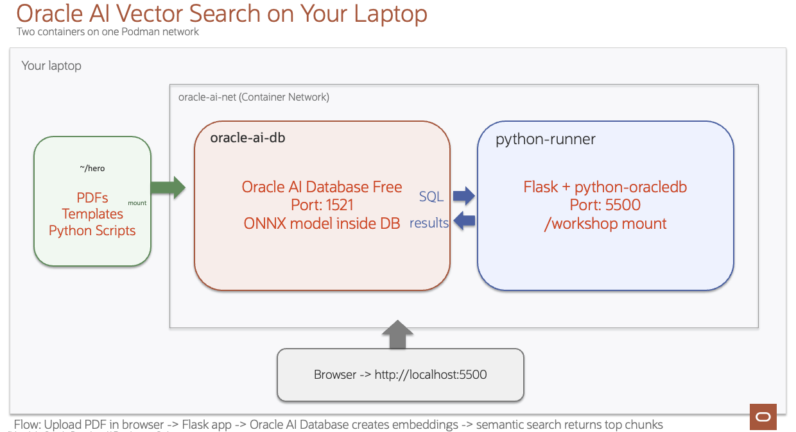

# Introduction

## About this Workshop

Welcome to **AI Vector Search on Your Laptop with Oracle AI Database Free**! In this hands-on workshop, you will build a complete AI-powered document search application entirely on your local machine using Oracle AI Vector Search. You do not need any cloud account.

You will start from scratch: spinning up two Podman containers: One for Oracle AI Database and one for Python. Then you will load a pre-built ONNX embedding model directly into the database, and progressively building Python scripts that load PDF documents, chunk their content, generate vector embeddings, and perform AI Vector Search. By the end, you will have a working Flask web application where you can upload any PDF and search across your document collection using natural language queries. Running Python in its own container guarantees a clean, reproducible environment: no library conflicts, no version mismatches, and no manual setup on your laptop.

Oracle AI Vector Search is built natively into Oracle AI Database, enabling similarity search on vectors (embeddings) alongside traditional relational data with no external vector store required. Everything lives in one database.

Vectors are numeric representations of meaning. Instead of matching only exact keywords, AI models convert text (and other data types) into vectors so semantically similar content sits close together in vector space. That is why vectors are now foundational for modern AI workloads, including semantic search, retrieval-augmented generation (RAG), recommendations, and agentic systems that need fast, context-aware retrieval.

Estimated Workshop Time: 1 hour 45 minutes

### Objectives

In this workshop you will:
- Install Oracle AI Database on your laptop using Podman containers
- Set up a dedicated Python container so all Python code runs in an isolated, reproducible environment. No local Python installation required!
- Connect to Oracle Database from Python and verify the installation
- Load a pre-built ONNX text embedding model into the database
- Load PDF documents, chunk the text, and generate vector embeddings using Oracle's native chunking functions
- Perform cosine similarity search to find the most relevant document chunks
- Build a Flask web application for PDF upload and semantic search

### Prerequisites

This workshop assumes you have:
* A laptop running macOS (Intel or Apple Silicon), Linux, or Windows with WSL2
* At least 8 GB of RAM (16 GB recommended)
* At least 20 GB of free disk space
* Internet access to download required software (Podman, container images, ONNX model)
* Basic familiarity with Python and SQL
* No Python installation required — all Python code runs inside a dedicated Podman container

## Learn More

* [Oracle AI Vector Search Documentation](https://docs.oracle.com/en/database/oracle/oracle-database/23/vecse/)
* [Oracle AI Database Free Container Image](https://container-registry.oracle.com)
* [Python python-oracledb Driver](https://python-oracledb.readthedocs.io/)

## Acknowledgements
* **Author** - Oracle LiveLabs Team
* **Last Updated By/Date** - Oracle LiveLabs Team, February 2026
